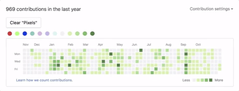

Hello there, i'm **Anjatiana**, i'm a student passionate about all things related to information technology

---
- I'm intersted on web and mobile development
- 💻 I'm currently on-improvement on my full stack development skills
- I'm looking to collaborate on open source project
- ⚡ Fun fact : love puzzle toys and chess

---
language and tools 
---

---
📫 How to reach me
---

**Thank you for visiting my profile 😉**
